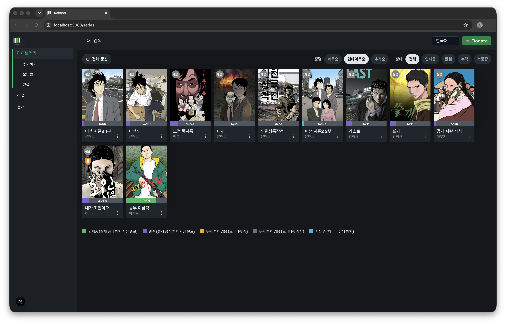
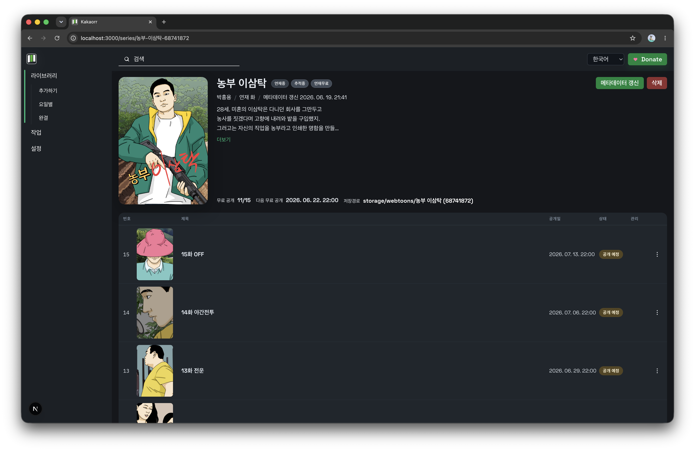
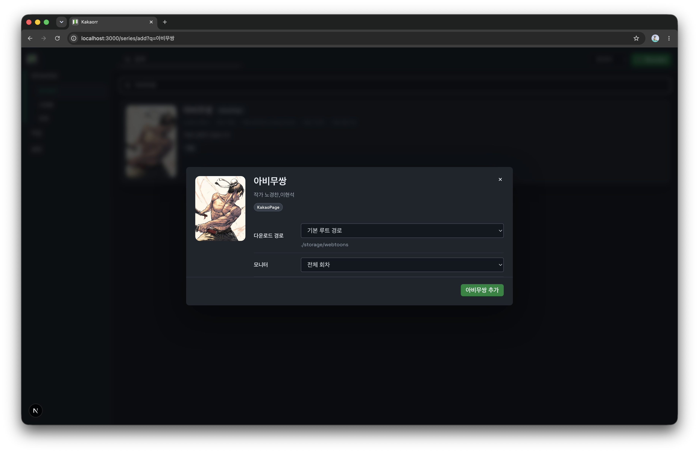

# Kakaorr

Kakaorr는 카카오페이지 웹툰 수집과 라이브러리 관리를 위한 개인용 관리자 UI입니다.  
개인 서버, NAS, Docker 환경에서 돌리는 것을 기준으로 설계하고 있습니다.

## 현재 상태

- 카카오페이지 검색, 요일별 탐색, 라이브러리 추가 UI 구현
- 작품 메타데이터 저장, 회차별 이미지 저장, 수동 재시도 구현
- 카카오 세션 업로드 기반 로그인 연동 구현
- 기다무 회차 자동 해금 시도 및 다음 해금 시각 예약 로직 구현

## 설치 요구 사항

- Node.js 22 이상
- npm 10 이상
- Docker / Docker Compose

## 설치 방법

### 로컬 실행

```bash
npm ci
npm run dev
```

브라우저에서 `http://localhost:3000`으로 접속합니다.

### Docker 실행

```bash
docker compose up -d --build
```

기본 포트는 `3000`입니다.

## Docker 구성

기본 `docker-compose.yml`은 아래 두 경로를 분리 마운트합니다.

- `/app/data`: 설정, 세션, 라이브러리 인덱스, 메타데이터
- `/app/storage`: 실제 다운로드된 웹툰 이미지와 포스터

현재 compose 서비스명은 `kakaorr`입니다.

필요하면 named volume 대신 bind mount로 바꿔도 됩니다.

```yaml
services:
  kakaorr:
    volumes:
      - ./data:/app/data
      - ./storage:/app/storage
```

## 카카오 로그인

카카오페이지 세션은 외부 브라우저에서 로그인 후 업로드하는 방식입니다.

로컬 환경 예시:

```bash
npm run kakao:bridge -- --kakaorr-url http://localhost:3000
```

설치 없이 실행하려면:

```bash
npm exec --yes --package=github:method404/kakaorr kakaorr-kakao-bridge -- --kakaorr-url http://localhost:3000
```

## 저장 구조

예시:

```text
data/
  library/
  settings/
  sources/
storage/
  webtoons/
    작품명 (seriesId)/
```

## 스크린샷






## 주의사항

- 개인 보관용으로만 사용하세요.
- 무단 공유, 서비스 약관 위반, 계정 제재 등 운영상 문제는 사용자 책임입니다.
- 본 프로젝트는 오픈소스이며 사용 결과를 보증하지 않습니다.

## 라이선스

이 프로젝트는 GNU Affero General Public License v3.0만 적용하는
[`AGPL-3.0-only`](./LICENSE) 라이선스를 따릅니다.

- 사용, 수정, 배포는 허용됩니다.
- 배포하거나 네트워크 서비스 형태로 제공하는 수정본은 대응 소스 공개 의무가 있습니다.
- 저작권 고지와 라이선스 전문은 함께 유지해야 합니다.
- 사용으로 인해 발생하는 문제나 손해에 대해서는 보증하지 않습니다.

라이선스 전문은 [LICENSE](./LICENSE)에서 확인할 수 있습니다.
